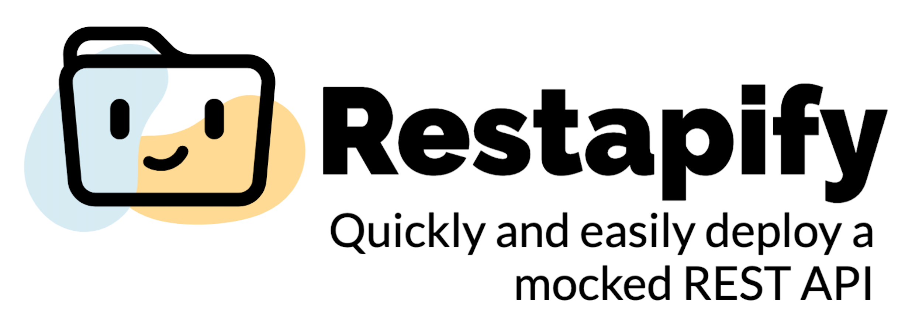

# Restapify

 

 

Restapify is a tool that allows you to quickly and easily deploy a local REST API by using an intuitive and developer friendly JSON file structure.

----
## Summary
- [**Why Restapify**](#why-restapify)
- [**Features**](#features)
- [**Documentation**](#documentation)
- [**Contributing**](#contributing)

## Why Restapify

When you start a new frontend project when the backend is not yet ready, you quickly come to the question of how to retrieve the data to be displayed. There are then many solutions that come with advantages but also some inconveniences. It's possible to use a tool like [postman](https://www.postman.com/) but it's not 100% free and require an account, to simply fetch local JSON data but it only supports a `GET` request or use a mocker library like [json-server](https://github.com/typicode/json-server), [mocker-api](https://github.com/jaywcjlove/mocker-api) or [http-fake-backend](https://github.com/micromata/http-fake-backend). 

The problem of most of this libraries is the way you have to define your API endpoints (a single file for all the routes, javascript files that took almost the same time to code than the real API, ...). Restapify try to make this process even faster with a file structure close to the one that you can see in [Nextjs](https://github.com/vercel/next.js) or [Sapper](https://github.com/sveltejs/sapper) and some developer friendly syntaxes to populate your json files.

## Features

- 💡 **Incredible DX** - Intuitive files structure and JSON syntax
- ✅ **JSON valid** - You will only use `.json` files that follows the [ECMA-404](https://www.ecma-international.org/publications-and-standards/standards/ecma-404/) standard
- 🎛 **Dashboard** - Out of the box SPA to explore and manage your mocked API
- 💻 **CLI** - Use the CLI for an instant deployment
- 🔥 **Built in hot watcher** - Directly see your changes after a file update
- 📝 **[Fakerjs](https://github.com/marak/Faker.js/) implementation** - Intuitive syntax to quickly populate your API responses
- 🚨 **Events handler** - Execute callbacks on specific events 
- 🛡 **TypeScript support**

## Documentation

Checkout the documentation on the [website](https://restapify.vercel.app/) or directly read it from the Markdown [source file](docs/README.md).

## Contributing

All remarks are welcome so feel free to [open an issue](https://github.com/johannchopin/restapify/issues).
Wants to collaborate? Please read the [contributing guidelines](./CONTRIBUTING.md).
